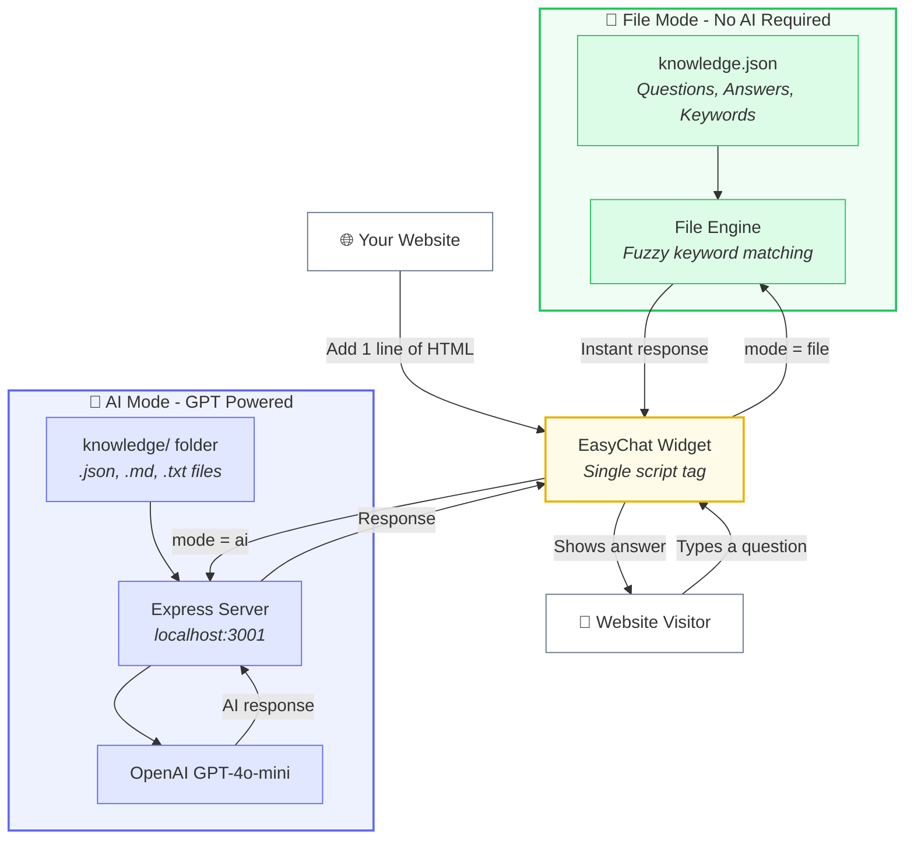
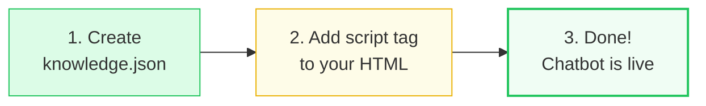
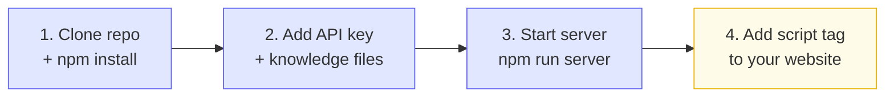

# EasyChat 💬

**Free, open-source embeddable chatbot for any website.**

Add a chatbot to your site in one line of code. Two modes: file-based (no AI) and AI-powered.

---

## How It Works

<br>
<center>



</center>
<br>

> **File Mode** runs 100% in the browser - no server, no API keys, no cost.
> **AI Mode** uses a small backend server to keep your OpenAI API key secure.

---

## Features

- **File Mode** - No AI, no API keys, no server. Answers from a JSON knowledge base using smart keyword matching. Runs 100% in the browser.
- **AI Mode** - GPT-powered responses using your knowledge base as context. Secure backend keeps your API key safe.
- **One Line Integration** - Single `<script>` tag. Works with any website.
- **Fully Customizable** - Colors, position, bot name, welcome message, suggested questions, dark mode.
- **Mobile Responsive** - Looks great on all screen sizes.
- **Zero Dependencies** - The widget is a standalone JS file (~16KB minified).

---

## Quick Start

### File Mode (No AI)

<br>



<br>

**Step 1 - Create a knowledge base file** (`knowledge.json`):

```json
[
  {
    "question": "What are your business hours?",
    "answer": "We're open Monday to Friday, 9am to 5pm.",
    "keywords": ["hours", "open", "schedule", "time"]
  },
  {
    "question": "How do I reset my password?",
    "answer": "Go to Settings > Account > Reset Password, or click 'Forgot Password' on the login page.",
    "keywords": ["password", "reset", "forgot", "login"]
  }
]
```

**Step 2 - Add the script tag** to your HTML:

```html
<script
  src="https://cdn.jsdelivr.net/gh/hoffeloffe/EasyChat@main/dist/easychat.min.js"
  data-mode="file"
  data-knowledge-url="/knowledge.json">
</script>
```

**That's it!** The chatbot will appear in the bottom-right corner of your website.

---

### AI Mode (GPT Powered)

<br>



<br>

**Step 1 - Clone and install:**

```bash
git clone https://github.com/hoffeloffe/EasyChat.git
cd EasyChat
npm install
```

**Step 2 - Set your OpenAI API key:**

```bash
cp .env.example .env
# Edit .env and add your OPENAI_API_KEY
```

**Step 3 - Add knowledge files** to the `knowledge/` folder (JSON, TXT, or MD files).

**Step 4 - Start the server:**

```bash
npm run server
```

**Step 5 - Add the script tag** to your website:

```html
<script
  src="https://cdn.jsdelivr.net/gh/hoffeloffe/EasyChat@main/dist/easychat.min.js"
  data-mode="ai"
  data-server-url="http://localhost:3001">
</script>
```

---

## Try the Demo Locally

The repo includes a `demo.html` file you can run locally to test file mode:

```bash
# From the EasyChat folder:
npx serve . -p 5500
```

Then open **http://localhost:5500/demo.html** in your browser.

> **Note:** You must serve the demo from an HTTP server. Opening `demo.html` directly as a `file://` URL won't work because browsers block local file fetching for security reasons. Any HTTP server works - `npx serve`, Python's `http.server`, VS Code Live Server, etc.

---

## Configuration

### Data Attributes

| Attribute | Description | Default |
|-----------|-------------|---------|
| `data-mode` | `"file"` or `"ai"` | Required |
| `data-bot-name` | Name shown in the header | `"EasyChat"` |
| `data-welcome` | Welcome message | `"Hi there! How can I help you today?"` |
| `data-knowledge-url` | URL to knowledge JSON (file mode) | `"/knowledge.json"` |
| `data-server-url` | Backend server URL (AI mode) | `"http://localhost:3001"` |
| `data-color` | Primary color (hex) | `"#6366f1"` |
| `data-position` | `"bottom-right"` or `"bottom-left"` | `"bottom-right"` |
| `data-dark` | Dark mode (`"true"` / `"false"`) | `"false"` |
| `data-config` | URL to a JSON config file | - |

### JSON Config File

For more control, use a config file:

```html
<script
  src="easychat.min.js"
  data-config="/chatbot-config.json">
</script>
```

```json
{
  "mode": "file",
  "botName": "Support Bot",
  "welcomeMessage": "Hey! How can I help?",
  "placeholder": "Ask me anything...",
  "knowledgeUrl": "/knowledge.json",
  "suggestions": [
    "What are your hours?",
    "How do I reset my password?",
    "Pricing info"
  ],
  "theme": {
    "primaryColor": "#6366f1",
    "position": "bottom-right",
    "darkMode": false,
    "borderRadius": 16,
    "width": 380,
    "height": 520
  },
  "autoOpenDelay": 5000
}
```

### JavaScript API

You can also create the widget programmatically:

```html
<script src="easychat.min.js"></script>
<script>
  const chat = new EasyChat({
    mode: "file",
    botName: "My Bot",
    knowledgeUrl: "/knowledge.json",
    theme: { primaryColor: "#10b981" }
  });

  // Open/close programmatically
  chat.open();
  chat.close();

  // Remove the widget
  chat.destroy();
</script>
```

---

## Knowledge Base Format

### JSON (Recommended)

```json
[
  {
    "question": "What is your return policy?",
    "answer": "You can return items within 30 days of purchase.",
    "keywords": ["return", "refund", "policy"],
    "category": "Orders"
  }
]
```

### Markdown / Text Files

Place `.md` or `.txt` files in the `knowledge/` folder. Each file becomes one knowledge entry where the filename is the question and the file content is the answer.

---

## Custom Styling

Override CSS variables to customize the look:

```css
.ec-widget {
  --ec-primary: #10b981;
  --ec-bg: #ffffff;
  --ec-text: #1f2937;
  --ec-border: #e5e7eb;
  --ec-radius: 16px;
  --ec-width: 400px;
  --ec-height: 600px;
}
```

---

## Project Structure

```
EasyChat/
├── widget/              # Widget source (vanilla TypeScript)
│   ├── easychat.ts      # Main widget class
│   ├── file-engine.ts   # File-based matching engine
│   ├── ai-engine.ts     # AI mode HTTP client
│   ├── styles.ts        # Widget CSS
│   └── types.ts         # TypeScript types
├── server/              # AI mode backend (Express)
│   ├── index.ts         # Server entry point
│   ├── chat.ts          # OpenAI chat handler
│   └── knowledge.ts     # Knowledge file loader
├── knowledge/           # Sample knowledge base
│   └── knowledge.json
├── dist/                # Built widget files (ready to use)
│   ├── easychat.js
│   └── easychat.min.js
├── src/                 # Next.js landing page
│   └── app/
├── demo.html            # Live demo page
└── scripts/
    └── build-widget.mjs # esbuild script
```

---

## Scripts

| Command | Description |
|---------|-------------|
| `npm run build:widget` | Build the widget to `dist/` |
| `npm run server` | Start the AI mode backend |
| `npm run dev` | Start the Next.js landing page |
| `npm run typecheck` | TypeScript check |
| `npm test` | Run unit tests |

---

## License

MIT - use it however you want, for free, forever.
