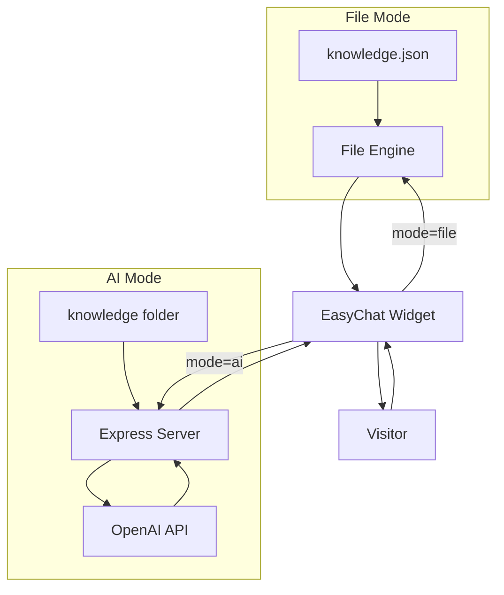

# EasyChat

Free, open-source embeddable chatbot for any website. Two modes: file-based (no AI needed) and AI-powered (GPT). One script tag to integrate.

## How It Works



**File Mode** runs entirely in the browser. No server, no API keys, no cost.

**AI Mode** uses a backend server to keep your OpenAI key secure and sends your knowledge base as context.

## Features

- **File Mode** -- Answers from a JSON knowledge base using keyword matching. No AI, no server, no API keys. 100% client-side.
- **AI Mode** -- GPT-powered responses grounded in your knowledge base. Secure backend keeps your API key safe.
- **One Line Integration** -- Single `<script>` tag. Works with any website: React, Vue, WordPress, plain HTML.
- **Customizable** -- Colors, position, bot name, welcome message, suggested questions, dark mode.
- **Mobile Responsive** -- Works on all screen sizes.
- **Zero Dependencies** -- Standalone JS file, ~16KB minified.

## Quick Start

### File Mode (No AI)

**1.** Create a `knowledge.json` file:

```json
[
  {
    "question": "What are your business hours?",
    "answer": "We're open Monday to Friday, 9am to 5pm.",
    "keywords": ["hours", "open", "schedule", "time"]
  },
  {
    "question": "How do I reset my password?",
    "answer": "Go to Settings > Account > Reset Password.",
    "keywords": ["password", "reset", "forgot", "login"]
  }
]
```

**2.** Add the script tag to your HTML:

```html
<script
  src="https://cdn.jsdelivr.net/gh/hoffeloffe/EasyChat@main/dist/easychat.min.js"
  data-mode="file"
  data-knowledge-url="/knowledge.json">
</script>
```

Done. The chatbot appears in the bottom-right corner.

### AI Mode (GPT Powered)

**1.** Clone and install:

```bash
git clone https://github.com/hoffeloffe/EasyChat.git
cd EasyChat
npm install
```

**2.** Set your OpenAI API key:

```bash
cp .env.example .env
# Edit .env and add your OPENAI_API_KEY
```

**3.** Add knowledge files to the `knowledge/` folder (.json, .txt, or .md).

**4.** Start the server:

```bash
npm run server
```

**5.** Add the script tag to your website:

```html
<script
  src="https://cdn.jsdelivr.net/gh/hoffeloffe/EasyChat@main/dist/easychat.min.js"
  data-mode="ai"
  data-server-url="http://localhost:3001">
</script>
```

## Try the Demo

The repo includes a `demo.html` file. To run it locally:

```bash
npx serve . -p 5500
```

Then open http://localhost:5500/demo.html in your browser.

> Opening `demo.html` directly as a `file://` URL won't work -- browsers block local file fetching for security. Use any HTTP server: `npx serve`, Python `http.server`, VS Code Live Server, etc.

## Configuration

### Data Attributes

| Attribute | Description | Default |
|---|---|---|
| `data-mode` | `"file"` or `"ai"` | Required |
| `data-bot-name` | Name shown in header | `"EasyChat"` |
| `data-welcome` | Welcome message | `"Hi there! How can I help you today?"` |
| `data-knowledge-url` | URL to knowledge JSON (file mode) | `"/knowledge.json"` |
| `data-server-url` | Backend URL (AI mode) | `"http://localhost:3001"` |
| `data-color` | Primary color hex | `"#6366f1"` |
| `data-position` | `"bottom-right"` or `"bottom-left"` | `"bottom-right"` |
| `data-dark` | Dark mode | `"false"` |
| `data-config` | URL to a JSON config file | -- |

### Config File

For more control, point to a JSON config:

```html
<script src="easychat.min.js" data-config="/chatbot-config.json"></script>
```

```json
{
  "mode": "file",
  "botName": "Support Bot",
  "welcomeMessage": "Hey! How can I help?",
  "placeholder": "Ask me anything...",
  "knowledgeUrl": "/knowledge.json",
  "suggestions": ["What are your hours?", "How do I reset my password?"],
  "theme": {
    "primaryColor": "#6366f1",
    "position": "bottom-right",
    "darkMode": false,
    "borderRadius": 16,
    "width": 380,
    "height": 520
  },
  "autoOpenDelay": 5000
}
```

### JavaScript API

```html
<script src="easychat.min.js"></script>
<script>
  const chat = new EasyChat({
    mode: "file",
    botName: "My Bot",
    knowledgeUrl: "/knowledge.json",
    theme: { primaryColor: "#10b981" }
  });

  chat.open();
  chat.close();
  chat.destroy();
</script>
```

## Knowledge Base Format

### JSON (recommended)

```json
[
  {
    "question": "What is your return policy?",
    "answer": "You can return items within 30 days of purchase.",
    "keywords": ["return", "refund", "policy"],
    "category": "Orders"
  }
]
```

### Markdown / Text

Place `.md` or `.txt` files in `knowledge/`. The filename becomes the question, the content becomes the answer.

## Custom Styling

Override CSS variables:

```css
.ec-widget {
  --ec-primary: #10b981;
  --ec-bg: #ffffff;
  --ec-text: #1f2937;
  --ec-border: #e5e7eb;
  --ec-radius: 16px;
  --ec-width: 400px;
  --ec-height: 600px;
}
```

## Project Structure

```
EasyChat/
  widget/              Widget source (vanilla TypeScript)
    easychat.ts        Main widget class
    file-engine.ts     File-based matching engine
    ai-engine.ts       AI mode HTTP client
    styles.ts          Widget CSS
    types.ts           TypeScript types
  server/              AI mode backend (Express)
    index.ts           Server entry point
    chat.ts            OpenAI chat handler
    knowledge.ts       Knowledge file loader
  knowledge/           Sample knowledge base
    knowledge.json
  dist/                Built widget files
    easychat.js
    easychat.min.js
  src/app/             Next.js landing page
  demo.html            Demo page
  scripts/
    build-widget.mjs   esbuild script
```

## Scripts

| Command | Description |
|---|---|
| `npm run build:widget` | Build widget to `dist/` |
| `npm run server` | Start AI mode backend |
| `npm run dev` | Start Next.js landing page |
| `npm run typecheck` | TypeScript check |
| `npm test` | Run unit tests |

## License

MIT
